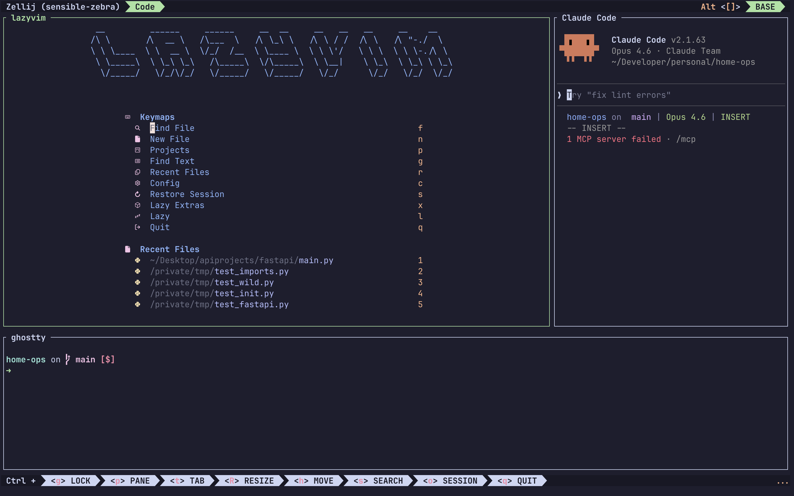
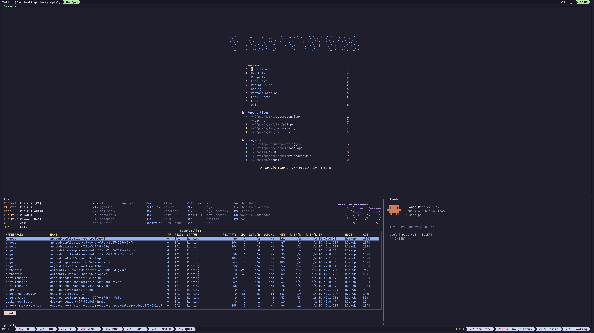
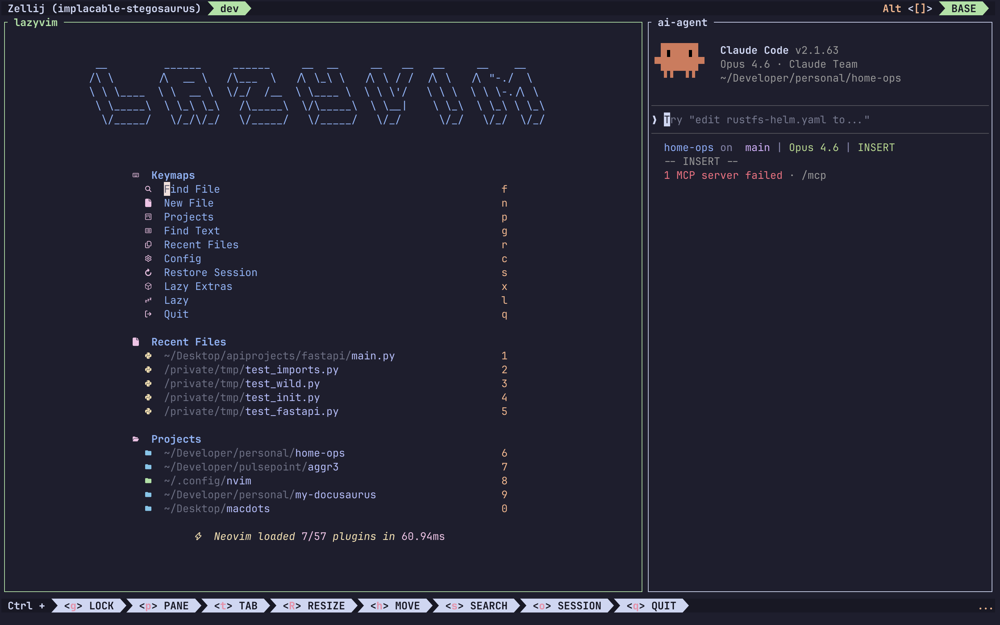

# zellij-layouts

Just some layouts for Zellij that I find useful in my workflows.

## How to use

To use these layouts, create `.kdl` files inside your `.config/zellij/layouts` directory. Once they're there add the following to your `.bashrc` or `.zshrc` file.

```zsh
alias zj="zellij"                                                     # opens zellij without a layout
alias zjd="zellij --layout ~/.config/zellij/layouts/desktop.kdl"      # desktop layout for zellij
alias zjl="zellij --layout ~/.config/zellij/layouts/laptop.kdl"       # laptop layout for zellij
alias zjdo="zellij --layout ~/.config/zellij/layouts/devops.kdl"      # devops layout for zellij
```

## Desktop

This layout provides 3 windows. The main window that opens [Lazyvim](https://www.lazyvim.org/) witin the directory you started. To the right of that, a pane starts with [Claude Code](https://code.claude.com/docs/en/overview). Below both just a plain terminal window.



```kdl
layout {
    tab name="Code" focus=true {

        pane size=1 borderless=true {
            plugin location="tab-bar"
        }

        pane split_direction="horizontal" size="70%" {
            pane split_direction="vertical" {
                pane size="70%" name="lazyvim" command="nvim" focus=true
                pane name="Claude Code" command="claude"
            }
        }

        pane size="23%" name="ghostty"

        pane size=1 borderless=true {
            plugin location="status-bar"
        }

    }

    new_tab_template {
        pane size=1 borderless=true {
            plugin location="tab-bar"
        }

        pane

        pane size=1 borderless=true {
            plugin location="status-bar"
        }
    }
}
```

## DevOps

This is my favourite layout. This provides 4 panes. The main pane starts with Lazyvim this spans across the whole window with about 60% height. Below that there ae 3 panes. Similar to the desktop layout there is a Claude Code pane. To the left of that you have 2 panes that are stacked. One that starts with [K9s](https://k9scli.io/) then a plain terminal window.



```kdl
layout {
    tab name="DevOps" focus=true {

    pane size=1 borderless=true {
      plugin location="tab-bar"
    }

    pane split_direction="horizontal" size="60%"{
      pane name="lazyvim" command="nvim" focus=true
    }

    pane split_direction="vertical" {
      pane stacked=true name="terminal" size="65%" {
        pane name="k9s" command="k9s" focus=true
        pane name="ghostty"
      }
      pane name="Claude Code" command="claude"

    }

    pane size=1 borderless=true {
      plugin location="status-bar"
    }

  }

  new_tab_template {
      pane size=1 borderless=true {
          plugin location="tab-bar"
      }

      pane

      pane size=1 borderless=true {
          plugin location="status-bar"
      }
  }

}
```

## Laptop

This layout is a replica of the Desktop layout, minus the bottom terminal pane.



```kdl
layout {
    tab name="dev" focus=true {
        pane size=1 borderless=true {
            plugin location="tab-bar"
        }
        pane split_direction="horizontal" size="65%" {
            pane split_direction="vertical" {
                pane size="65%" name="lazyvim" command="nvim" focus=true
                pane name="ai-agent" command="claude"
            }
        }
        pane size=1 borderless=true {
            plugin location="status-bar"
        }
    }

    new_tab_template {
        pane size=1 borderless=true {
            plugin location="tab-bar"
        }
        pane
        pane size=1 borderless=true {
            plugin location="status-bar"
        }
    }
}
```

### Notes:

The beauty of Zellij and I am sure this is the case for tmux. You can stack the panes, for example with the AI panes you could stack differents agents, allowing you to cycle between different agents or the same one so you can work in different git worktrees. Example:

```kdl
pane stacked=true name="AI" {
  pane name="Claude Code" command="claude" focus=true
  pane name="OpenCode" command="opencode"
  pane name="Codex" command="codex"
}
```
